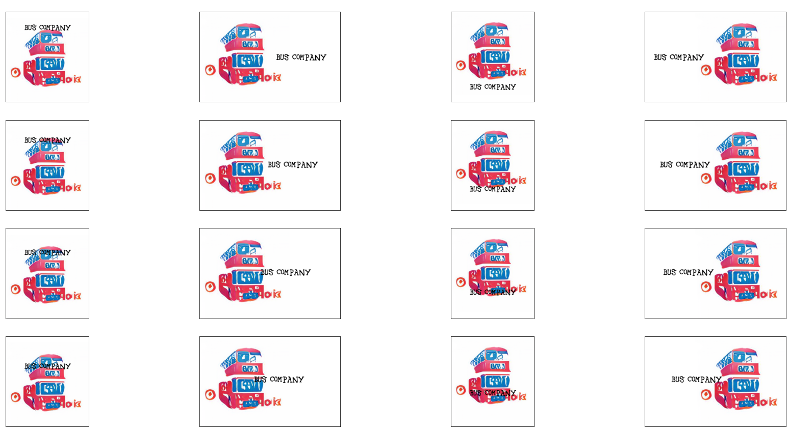

# LogoAI
## Installation
### 1. Clone the repository
To run the code, use the following command to clone the repository:
```diff
git clone https://github.com/aldietri/LogoAI
```
This project makes use of the following repositories:
```diff
https://github.com/matterport/Mask_RCNN
```
```diff
https://github.com/junyanz/pytorch-CycleGAN-and-pix2pix
```

### 2. Set up pretrained weights
This repository requires you to setup multiple files and weights for the pretrained models. Please go ahead and download the following files to use fully make use of our LogoAI:
https://drive.google.com/drive/folders/1SKKku3sm8ou6T20PDRoKbsiMeUCr3k-_?usp=sharing

Data:
* testA

Weights:
* Mask_RCNN: mask_rcnn_coco.h5
* CycleGAN: Objects2Icons

Move the downloaded files in the main directory and run the setup.py file. This will clone the necessary repositories and move the model weights and test data to their proper respective paths.

```diff
python setup.py
```
### 3. Install the requirements
1) Install all necessary requirements of the following libraries:
    * Mask_RCNN
    * CycleGAN
    * PNG_SVG_Conversion
    
2) Make sure to install all necessary requirements:
```diff
pip install -r requirements.txt
```

If you want to train your own models, refer to the CycleGAN documentation. This project made use of the MS COCO and LLD for training the CycleGAN model.

## Process
The usage of this repository is demonstrated in the notebook [Example.ipynb](Example.ipynb). The following sections will covers the process from image to the final logo output.
### 1. Segmentation
First the user's image is segmented into multiple instances. In that the segmentation takes the three largest instances and the three largest regions (connected instances) and uses them as candidates for logo creation.


### 2. Image2Icon
The segmented image parts are then cut out and fed into the CycleGAN model that translates each instance into multiple logo variants. It does so by taking different CycleGAN save states taken during training. Each logo variant is first generated as a png and then also transformed into a svg version by making use of the PNG_SVG_Conversion code. An examplary transition from instance to logo can be seen below.


### 3. Layout
The user has then to manually select the logo of their liking. The logo is then fed into a saliency map model that determines areas of attention. These are used to create four different bounding boxes that serve as a basis from which text can be automatically positioned next to a logo.


### 4. Output
Finally, the output consists of 16 images (no. of bboxes x no. of directions) where the specifed text is placed at each direction for each of the previously determined bounding boxes.


