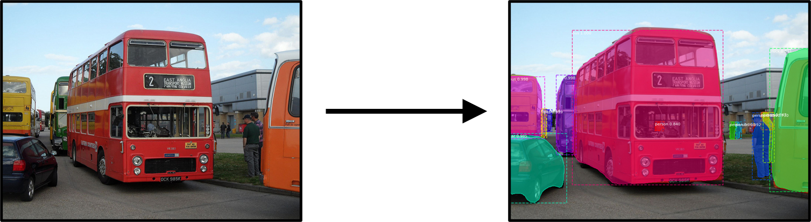
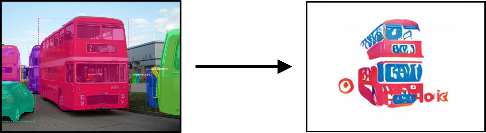
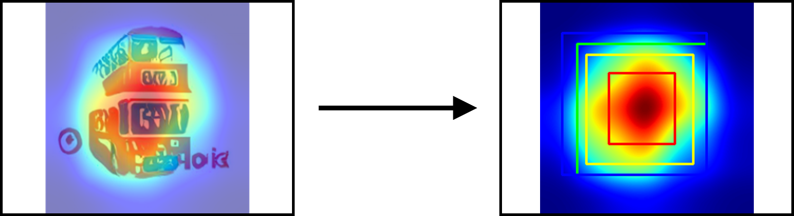

# LogoAI
## Installation
### 1. Clone the repository
To run the code, use the following command to clone the repository:
```diff
git clone https://github.com/aldietri/LogoAI
```
This project makes use of the following repositories:
```diff
git clone https://github.com/matterport/Mask_RCNN
```
```diff
git clone https://github.com/junyanz/pytorch-CycleGAN-and-pix2pix
```
### 2. Install the requirements
1) Install all necessary requirements of the following libraries:
    * Mask_RCNN
    * CycleGAN
    * PNG_SVG_Conversion
    
2) Make sure to install all necessary requirements:
```diff
pip install -r requirements.txt
```

### 3. Set up pretrained weights
This repository requires you to setup multiple files and weights for the pretrained models. Please go ahead and download the following files to use fully make use of our LogoAI:
https://drive.google.com/drive/folders/1SKKku3sm8ou6T20PDRoKbsiMeUCr3k-_?usp=sharing

Data:
* testA

Weights:
* Mask_RCNN: mask_rcnn_coco.h5
* CycleGAN: Objects2Icons

Move the downloaded files in the main directory and run the setup.py file. This will move the model weights and test data to their proper respective path.

```diff
python setup.py
```

If you want to train your own models, refer to the CycleGAN documentation. This project made use of the MS COCO and LLD for training the CycleGAN model.

## Process
The usage of this repository is demonstrated in the notebook [Example.ipynb](Example.ipynb). The following sections will cover the process from image to the final logo output.
### 1. Segmentation

### 2. Image2Icon

### 3. Layout

### 4. Output
